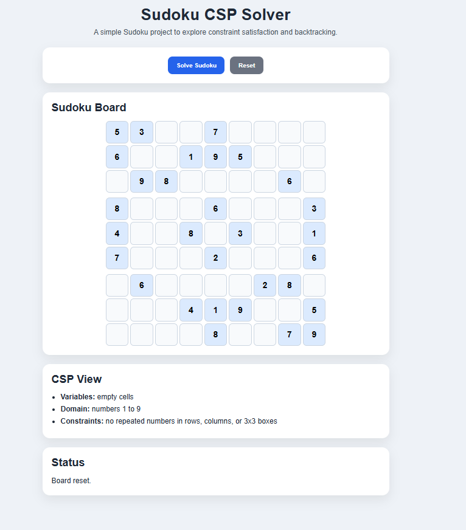
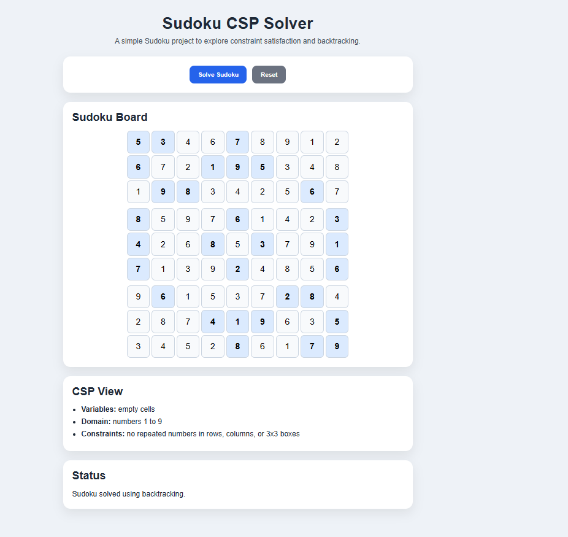

# 🧠 Sudoku CSP Solver – Backtracking Demo

A simple front-end project built with HTML, CSS, and JavaScript to demonstrate how Constraint Satisfaction Problems (CSPs) work through Sudoku solving.

---

## 🚀 Live Demo

👉 [View the app](https://devcodemate.github.io/sudoku-csp-solver/)

---

## 💻 Repository

👉 [View source code](https://github.com/devCODEMATE/sudoku-csp-solver)

---

## 📸 App Preview

### Initial Board

### Solved Board

---

## 📌 Project Overview

This project models Sudoku as a Constraint Satisfaction Problem (CSP).

In this app:
- empty cells are the variables
- numbers 1 to 9 are the domain values
- Sudoku rules are the constraints

The solver uses backtracking to fill the board while respecting all row, column, and 3x3 subgrid constraints.

---

## 🧩 CSP Structure

- **Variables:** empty cells
- **Domain:** numbers 1 to 9
- **Constraints:**
  - no repeated numbers in a row
  - no repeated numbers in a column
  - no repeated numbers in a 3x3 box

---

## ⚙️ Features

- 9x9 Sudoku board
- Prefilled and editable cells
- Constraint-based validation
- Backtracking solver
- Reset functionality
- Clean UI

---

## 🛠️ Technologies

- HTML
- CSS
- JavaScript

---

## 🧪 Example Use

1. Open the board
2. Click **Solve Sudoku**
3. Watch the puzzle get solved automatically

---

## 🧠 Concepts Applied

- Constraint Satisfaction Problems (CSPs)
- Variables, domains, constraints
- Backtracking
- Recursive search
- Puzzle solving in AI

---

## 💡 Key Learning

This project helped me understand how CSPs work in a more formal way. Instead of checking a single rule at a time, the solver explores possibilities, rejects invalid paths, and backtracks until it finds a valid solution.

---

## 🔮 Future Improvements

Possible next steps for extending this project:

- Add animated solving steps
- Highlight invalid user inputs
- Support multiple Sudoku boards
- Add a board generator
- Compare solving speed across puzzles

---

## 👩‍💻 Author

<CodeMate> — building projects to learn AI through hands-on development 🚀
